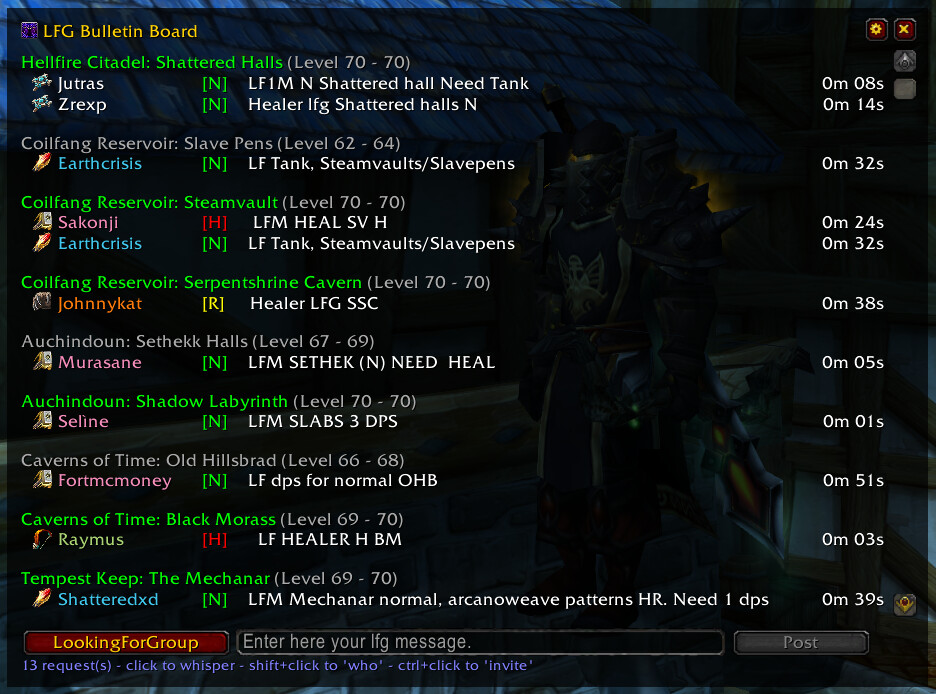

# LFG Bulletin Board

### Dungeon Request Chat Filtering

GBB provides an overview of the endless requests in the chat channels.  
It detects all requests to the classic dungeons, sorts them and presents them clearly way.  
Numerous filtering options reduce the gigantic number to exactly the dungeons that interest you.  
If that's not enough, GBB will let you know about any new request via a sound or chat notification.  
Finally, GBB allows you to easily post your LFG messages with a button press. (though not automatically)  
Currently, English, German and Russian dungeons are recognized natively. However, it is easily possible to adapt GBB to any language.  

### Usage

GBB searches the chat messages for dungeon requests in the background.  
To whisper a person, simply click on the entry with the left mouse button.  
For a "/who" a shift + left click is enough.  
The dungeon list can be filtered in the settings. You can also fold this by left-clicking on the dungeon name.  
Old entries are filtered out after 150 seconds by default.  

#### Slash Commands

`<value>` can be true/false, 1/0, or enable/disable. If `<value>` is omitted, then it will toggle between enabled/disabled.  
 
`/gbb notify chat <value>` - on new request make a chat notification  
 
`/gbb notify sound <value>` - on new request make a sound notification  
 
`/gbb debug <value>` - show debug information  
 
`/gbb reset` - reset main window position  
 
`/gbb config/setup/options` - open configuration window  
 
`/gbb about` - open about window  
 
`/gbb help` - print help/commands  
 
`/gbb chat organize/clean` - Create a new chat tab if one doesn't already exist, named "LFG" with all channels subscribed. This removes LFG heavy spam channels from the default chat tab.  
 
`/gbb` - open main window  
 
### Note

Between having a full time big boi job that pays for my hot tub stream addiction and playing TBC, my time is limited which might mean support of this addon may be limited  

### Credits

- I (Vysci) am not the creator of the addon. All credit goes to the author of the original addon: https://www.curseforge.com/wow/addons/group-bulletin-board  
- Arrogant_Dreamer, Hubbotu and kavarus for the russian translations  
- Baudzilla for the graphics/idea of the resize-code  
